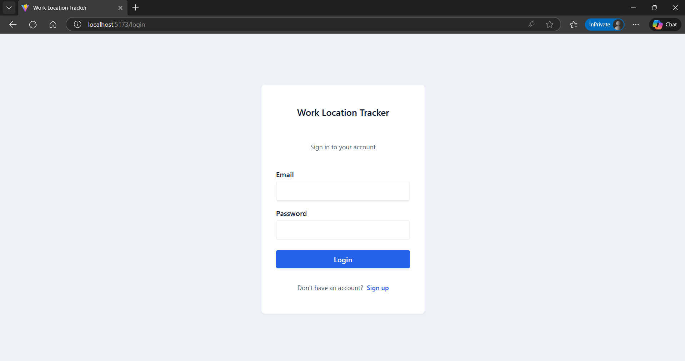
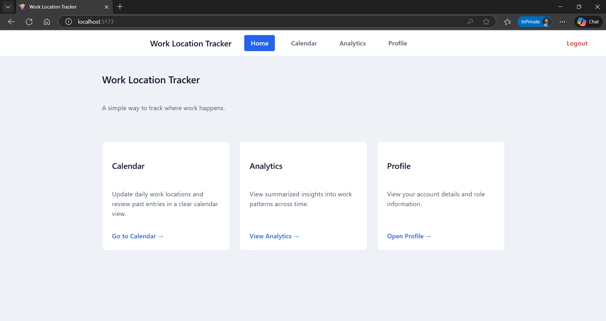
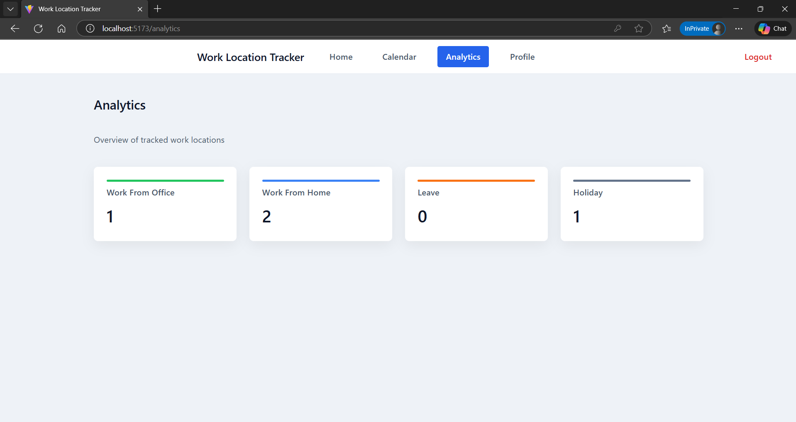
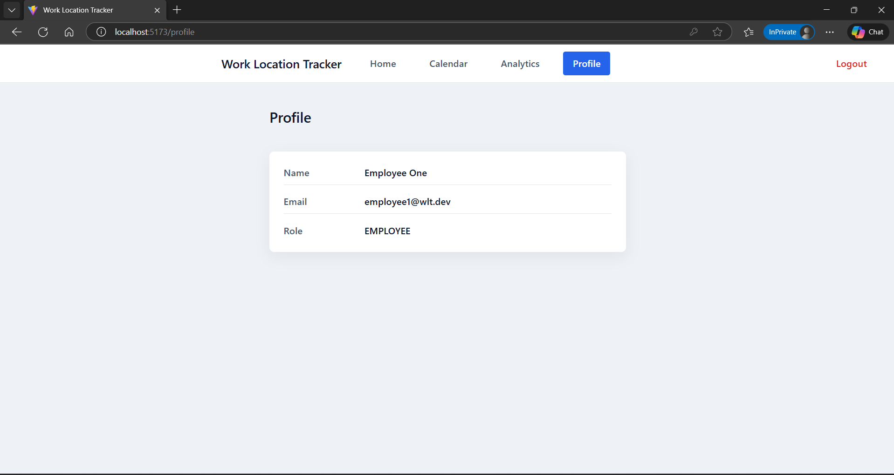

# Work Location Tracker – Demo

This document provides a visual walkthrough of the **Work Location Tracker** application, demonstrating the primary user flows and features available in the current release.

---
## 1. Signup Page

The application starts with a login screen that authenticates users before granting access to the system.

---
## 2. Login Page

The application starts with a login screen that authenticates users before granting access to the system.

---

## 3. Home Page

After successful login, users are redirected to the home page, which serves as the central navigation point of the application.

---

## 4. Calendar View

The calendar view allows users to visualize their work locations across different dates.

---

## 5. Analytics Dashboard

The analytics view provides insights into work location patterns, helping users understand trends over time.

---

## 5. Profile Dashboard

The analytics view provides insights into work location patterns, helping users understand trends over time.

---

## Notes
- Screenshots reflect the application state at the time of the current release.
- UI and analytics features may evolve in future versions.

